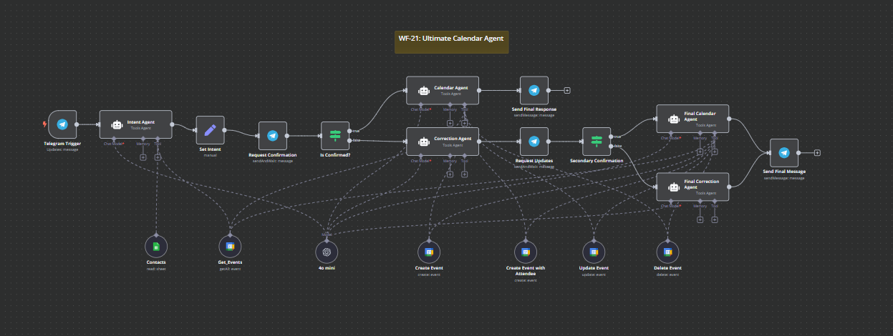

# WF-21: Ultimate Calendar Agent – n8n Workflow

## 📌 Overview
This **n8n workflow**, `WF-21: Ultimate Calendar Agent`, serves as an intelligent **calendar management assistant** that operates through Telegram. It allows users to create, update, delete, and view calendar events via natural language requests, making calendar management intuitive and conversational.

## 🔧 Workflow Components
### 🏗️ Core Modules
1. **💬 Telegram Trigger** – Initiates the workflow when a user sends a message via Telegram.
2. **🤖 Intent Agent** – Analyzes user queries to determine the intended calendar action.
3. **📅 Calendar Agent** – Executes calendar operations based on confirmed user intent.
4. **🔄 Correction Agent** – Handles user clarifications and refines calendar requests.
5. **✅ Confirmation Flow** – Ensures user validation before executing calendar changes.
6. **📋 Contact Management** – Retrieves contact information for event attendees.
7. **📆 Calendar Operations** – Create, update, delete, and retrieve events from Google Calendar.

## ⚙️ How It Works
1. 💬 User sends a calendar-related request via Telegram (e.g., "Schedule a meeting with John tomorrow at 2pm").
2. 🤖 The **Intent Agent** interprets the request and determines the required calendar action.
3. ✅ The workflow asks for user confirmation of the interpreted request.
4. 📋 If attendees are mentioned, the **Contacts** tool retrieves their email information.
5. 📅 If the user confirms, the **Calendar Agent** executes the appropriate calendar action:
   - Creates new events (with or without attendees)
   - Updates existing events
   - Deletes events
   - Retrieves event information
6. 🔄 If clarification is needed, the **Correction Agent** refines the request based on user feedback.
7. 📩 The workflow sends a confirmation message to the user upon completion.

## 📷 Workflow Screenshot

## 🚀 Setup Instructions
- 📥 **Import the workflow** into your n8n instance.
- 🔑 **Configure API credentials** for:
  - Telegram Bot
  - Google Calendar
  - Google Sheets (for contacts)
  - OpenAI (for AI agents)
- 📝 **Set up a Google Sheet** with contact information including names and email addresses.
- ✅ **Activate the workflow** to begin processing calendar requests via Telegram.

## 📝 Notes
- ⚠️ The workflow is **inactive by default**.
- 💡 The workflow uses GPT-4o Mini for natural language processing.
- 🛠️ Customize system prompts to enhance response quality for your specific needs.
- 📚 Contacts are stored in a Google Sheet for easy management and updates.
